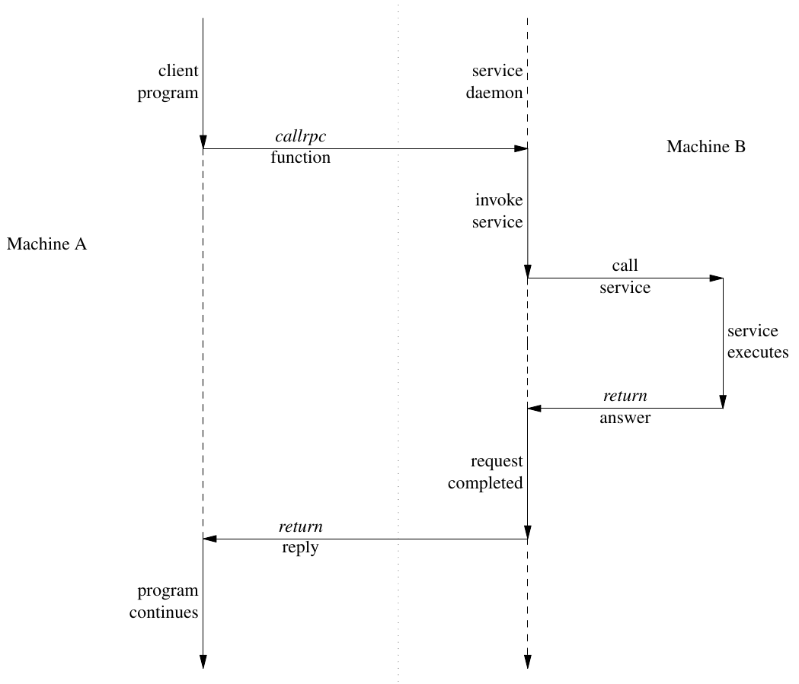
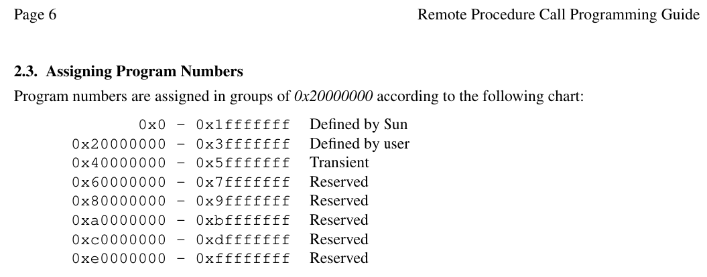

<h2 align="center">Distributed Systems Security</h2>
<h3 align="center">Ahmed Walid</h3>

<h3 align="center">~Remote Procedural Calls~</h3>

<p align="center">
    <br />
    <a href="https://github.com/ahmeddwalid/Finjan/blob/main/README.md"><strong>Explore the docs »</strong></a>
    <br />
    <br />
    <a href="https://github.com/ahmeddwalid/Finjan/issues">Report Bug</a>
    ·
    <a href="https://github.com/ahmeddwalid/Finjan/pulls">Request Feature</a>
  </p>

**This is written by me and not AI generated (fr, my wrist hurts)**
I read these two papers from FreeBSD to understand 

1. [Remote Procedure Call Programming Guide](https://docs-archive.freebsd.org/44doc/psd/23.rpc/paper.pdf)

2. [rpcgen Programming Guide](https://docs-archive.freebsd.org/44doc/psd/22.rpcgen/paper.pdf)

Feel free to read them for more in depth information as they were my primary sources, plus I didn't use Broadcast RPC or Batching nor the Authentication and these advanced topics

## The installation: (I'm using Fedora Linux)

## First of all update the package index:

```bash
sudo dnf update
```

## rpcgen is a part of the rpcbind package on Fedora so let's install it:

```bash
sudo dnf install rpcbind
```

## Now install the `rpcgen` tool:

```bash
sudo dnf install rpcgen
```

## Verify the installation:

```bash
rpcgen -v
```

That’s it! You should now have rpcgen installed on Fedora 41 which is currently the latest version, actually any distribution should work inshaAllah, just search how to install it correctly, if you're on a Debian based system use "apt" instead of "dnf" and I think it should work

# What is a Remote Procedural Call?

Okay soo the idea of RPC is actually pretty simple, imagine you've got a client app that needs to use a service provided by a server, like somewhere else on the network. Instead of dealing with all the complexities of a network protocol's directly, the client makes what look's like a regular function call, a local call, but what's really happening is that this call gets turned into a data packet that's sent over the network to the server. The server then picks up this request, does whatever task that was asked of it and then sends back a reply packet to the client with the results, from the client side it really seems like a regular function call, the difference is that it's through the network. This abstraction hides all these messy details about the actual network communication from sockets, ports, handshakes and all of that

RPC is built on top of low level protocols like TCP/IP and UDP. It's split up into three layers

## The Highest Layer

The top layer is independant of the operating system it's running on. Oh btw this layer isn't part of the core RPC functionality, it's more of a phylosophy of how it's done. This layer focuses on making it easy for the programmer to write programs without much control over the networking detatils

## The Middle Layer

The middle layer is where you start making these remote procedural calls yourself, but you still don't need to get down on these low level details of networking like managing sockets or directly working with the operating system's networking stuff. This layers main goal is to provide a more straight forward way to use remote services

If you read the RPC Programming Guide you'll find  `registerrpc()`, `callrpc()`, and `svc_run()`

What are these?

On the **sever side** you use `registerrpc()` mainly, it basically associates a specific c function with a specific unique RPC procedure number (this is what makes the RPC function able to be called remotely) 

On the **client side** `callrpc()` is the main one, it's the funtion that actually makes the remote procedural call happen.
Think of it like this:
`registerrpc()` is the server saying "Hey, I offer this service and here's the service number"
`callrpc()` is the client saying "Okay I wanna use server number x on this particular machine"

But the guide points out that this middle layer comes with some limitations, afterall it's made for simplicity. What are these limitations you may ask?...

One big thing is that you don't have control over how long the client waits for a response from the server, there are some default timeouts but you can't easily customize them. You're also kinda stuck with UDP as the transport protocol.. There's no real error handling, no way to manage the proccesses and no support for things like authentication. There's even an 8 kilobyte limit on how much data you could send at once for UDP at this level.

It's great for basic and small scale stuff, yet if you need to send larger amounts of data or you need more reliability or security this isn't fit.

And that's where the lowest layer comes in, it gives you more fine grained control over everything

What kind of control?

## The Lowest Layer

This let's you customize everything, like you can use TCP instead of UDP and bypass that 8KB limit giving you a more reliable connection, you also get alot of control on how data is converted between different formats using something called 'XDR' (Stands for: External Data Representation) for Serialization and Deserialization. It is used to make sure that data sent between different computer systems (potentially with different architectures) can be correctly interpreted by both the sender and the receiver in a standardized way. And you can even implement alot of ways you can authenticate all of these calls to make sure they're secure.

Cool right? not so much, while the guide mentions that pograms written at this level can be more efficient, it also points out that the network isn't actually the bottleneck most of the times, so this level of optimizaiton might not be needed

Something else to say here is that RPC isn't just tied to the C language you can implement it with other languages and you can even use it for communication between proccesses on the same machine, it's not just for networking

## The Diagram

This guide has a nice illustration for it



## The Program Numbers

Remember the program numbers we talked about above? Imagine this as an identifier, the same way you'll need to know the name of the funtion to call it, RPC need this program number to identify what to do



The range from 0x0 to 0x1fffffff is managed by Sun Microsystems (Which is Oracle now btw), if you want to use one of these globally, you'd have to ask them for a number to have the license and make sure it's unique

The next range from 0x20000000 to 0x3fffffff is for programs that users define themselves, this is mostly for testing and debugging RPC applicaitons before they're released

Then there's a transient range, this group is reserved for applications that generate program numbers at runtime

And the rest groups are reserved for future use and should not be used, idky tho

## XDR (Wallahu A3lam)

This handles Serialization and Deserialization as mentioned, these are needed becuse not all machines store/manage data the same way. So we use XDR to standardize these data so it can be sent over and be understood (Something like a protocol, but it's called "routines" for some reason)

It also manages the network endianess, like doctor Ayman Adel told us in the lecture that the standardized way of ordering bytes when transmitting data across networks is big-endian, meaning that the most significant byte is transmitted first.

XDR has memory allocation and these stuff, but that's now too deep and I feel lost at it

Now onto the coding part

## rpcgen tool

This should be installed on your machine by now

rpcgen is a protocol compiler, it basically takes care of writing alot of the code for you that you would otherwise have to write it all yourself, it generates all the functions that the client and servers use to communicate, the XDR routines for handling data and the header files to for network configurations and so.

This let's you focus on the important part which is the logic of your applicaiton

It's written in a language called RPC Language that looks very similar to C

ps: in the RPC Language a you'll find a string data type, this is not exactly like an array of characters in c. This string is always null terminated and carries data about the maximum length of the string 

## Writing the code

The first step is to define what your remote procedural call looks like, you do this in a file called RPC Language Protocol Specification File, this has a ".x" file extension.

In this file you declare a program with a unique program number and a version number, inside that version you define the procedure itself. You give it a name and you specify the datatypes of the arguments

We first need to define our remote program and the procedure it will offer in an RPC language file (ending with ".x" extension).

- Program Name: We'll call our remote program SUBSTRING_PROG.

- Version Number: We'll start with version 1 of our program, so SUBSTRING_VERS.

- Procedure: We'll define one remote procedure called IS_SUBSTRING. This procedure will take two strings as input and return a boolean value (true if one is a substring of the other, false otherwise).

- **struct string_pair { ... };** 
  
  We define a structure named string_pair to hold our two input strings. Using a structure allows us to pass both strings as a single argument to our remote procedure. The <> after string indicates that the strings can be of arbitrary length

- **program SUBSTRING_PROG { ... } = 0xD2B44F1;**
  
  This declares our remote program named SUBSTRING_PROG. The number 0xD2B44F1 is a program number, which uniquely identifies this RPC service on the network. You should choose a number within the user-defined range (0x20000000 - 0x3fffffff) for your own applications . 
  
  You can use a decimal representation here (`123456789` in decimal is the same as `0x75BCD15` in hexadecimal which is in range)

- **version SUBSTRING_VERS { ... } = 1;**
  
  Inside the program, we define a version named SUBSTRING_VERS with the version number 115 . This allows you to evolve your service in the future while maintaining compatibility with older clients.

- **bool IS_SUBSTRING(string_pair) = 1;**
  
  This declares our remote procedure IS_SUBSTRING. It takes one argument of type string_pair and is assigned the procedure number 1 within this version. It is declared to return a bool (which will be translated to bool_t in C).

Generating the RPC Code using rpcgen

Now that we have our substring.x file, we can use rpcgen to generate the necessary C code. Open your terminal and navigate to the directory where you saved substring.x. Then, run the following command:

```bash
rpcgen substring.x
```

This command will generate several files:

- **substring.h:**
  
  This is the header file containing definitions for the program number, version number, procedure number, the string_pair structure, and the function prototypes and server skeleton.

- **substring_clnt.c:**
  
  This file contains the client-side stub routines. These are the functions your client program will call.

- **substring_svc.c:**
  
  This file contains the server-side skeleton code. It handles receiving requests and dispatching them to your server implementation.

- **substring_xdr.c:**
  
  This file contains the XDR routines for serializing and deserializing the string_pair structure.

## Server-Side Procedure

Implementing the Server-Side Procedure

Next, we need to write the actual implementation of the IS_SUBSTRING procedure on the server. Create a new file named substring_server.c with the following content:

- **#include "substring.h":**
  
  We include the header file generated by rpcgen so we have access to the definitions for our program, version, and data structures.

- **bool_t * is_substring_1_svc(string_pair *argp, struct svc_req *rqstp):**
  
  This is the implementation of our remote procedure IS_SUBSTRING (note the _1_svc suffix, which is the convention for server-side procedure implementations for version 1).
  
  It takes a pointer to the input argument (string_pair *argp) and a pointer to a service request structure (struct svc_req *rqstp) as arguments22 .... The rqstp can contain information about the client making the request (like authentication details, though we're not using that here).

- We declare a `static bool_t` result. It's crucial that the result returned by an RPC service procedure is declared as static because the memory associated with the result needs to persist after the function returns until the RPC system sends the reply back to the client.

- We extract the two strings from the string_pair argument.

- We use the standard C library function strstr(s2, s1) to check if s1 is a substring of s2, and strstr(s1, s2) to check if s2 is a substring of s126 . strstr returns a pointer to the first occurrence of the substring in the main string, or NULL if the substring is not found.

- We set the result to TRUE if either check is successful, and FALSE otherwise.

- We return a pointer to the result. RPC service procedures always return a pointer to their result.

- **int main(int argc, char **argv):**
  
  This is the main function of the server program.

- **pmap_unset(SUBSTRING_PROG, SUBSTRING_VERS);**
  
  This line removes any previous registration of our service with the portmapper. The portmapper (or rpcbind on more modern systems) is a service that runs on the server machine and maps RPC program and version numbers to the network ports where the corresponding server is listening.

- **transp = svcudp_create(RPC_ANYSOCK); and svc_register(...):**
  
  These lines create a transport handle for UDP (User Datagram Protocol) and register our service (substring_prog_1) with the RPC system to listen for requests on UDP for our program and version21 .... RPC_ANYSOCK tells the system to choose any available port.

- **transp = svctcp_create(RPC_ANYSOCK, 0, 0); and svc_register(...):**
  
  Similarly, these lines create a transport handle for TCP (Transmission Control Protocol) and register our service to listen for requests on TCP as well30 .... Using both UDP and TCP makes our service more flexible.

- **svc_run();**
  
  This function enters the main server loop, where it listens for incoming RPC requests and dispatches them to the appropriate service procedures (like our is_substring_1_svc function) It typically never returns

- The fprintf and exit calls after svc_run() are there for error handling in case svc_run unexpectedly returns.

## Client-Side Program

- **#include "substring.h":**
  
  We include the generated header file.

- **CLIENT *clnt;**
  
  This declares a pointer to a client handle. This handle is what we use to communicate with the remote server37 ....

- **string_pair strings;**
  
  This declares an instance of the string_pair structure to hold the two strings we want to check.

- **bool_t *result_1;**
  
  This declares a pointer to a bool_t where the result from the remote procedure will be stored.

- **server = argv4 ; strings.s1 = argv1 ; strings.s2 = argv2 ;**
  
  We get the server hostname (or IP address) and the two strings from the command-line arguments.

- **clnt = clnt_create(server, SUBSTRING_PROG, SUBSTRING_VERS, "udp");**
  
  This is the crucial step of creating the client handle

- **server**
  
  The hostname or IP address of the server. You can use "localhost" if the server is running on the same machine.

- **SUBSTRING_PROG**
  
  Our program number.

- **SUBSTRING_VERS**
  
  Our program version number.

- **"udp"**
  
  The transport protocol we want to try first. We also try "tcp" as a fallback.

- `clnt_create` returns a pointer to the client handle if successful, and NULL if it cannot connect to the server. We check for errors and use clnt_pcreateerror to print a descriptive error message if the connection fails

- **result_1 = is_substring_1(&strings, clnt);**
  
  This is where we actually call the remote procedure

- **&strings**
  
  We pass a pointer to our strings structure as the argument

- **clnt**
  
  The client handle we created.

- `is_substring_1` is the client stub function generated by rpcgen. It takes a pointer to the arguments and the client handle. It handles the marshalling of the arguments into XDR format, sending the request to the server, waiting for the reply, and unmarshalling the result.

- `is_substring_1` returns a pointer to the result (a bool_t in this case), or NULL if an error occurred during the remote call. We check for errors using clnt_perror

- **if (*result_1 == TRUE) { ... } else { ... }**
  
  We dereference the result_1 pointer to access the boolean value returned by the server and print the appropriate message.

- **clnt_destroy(clnt);**
  
  This releases the resources associated with the client handle

## Compiling the program

Now we need to compile our client and server programs. You'll need a C compiler (like GCC) and the RPC development libraries installed on your system.

On Linux and FreeBSD:

Open your terminal and navigate to the directory where you saved all the .c and .h files.

Compile the server:

```
cc -c substring_svc.c substring_server.c substring_xdr.c -o substring_server.o
cc substring_server.o -o substring_server -lrpc
```

Compile the client:

```
cc -c substring_clnt.c substring_client.c substring_xdr.c -o substring_client.o
cc substring_client.o -o substring_client -lrpc
```

The -lrpc flag tells the compiler to link against the RPC library.

## Running the Program

1. **Start the Portmapper/rpcbind:**

Before you can run the RPC server, you need to make sure the portmapper (on older systems) or rpcbind (on more recent systems) is running on the server machine. This service is responsible for mapping RPC program numbers to network ports. It's usually started automatically at boot. You can check its status and start it if necessary (you might need root privileges):

Linux (using systemd):

```
sudo systemctl status rpcbind.socket
sudo systemctl start rpcbind.socket
```

FreeBSD:

```
sudo service portmap status
sudo service portmap start
```

2. **Run the Server:**

On the machine where you compiled the server (this could be a remote machine or your local machine), run the server program in the background:

```
./substring_server &
```

You should see no output if it starts successfully. The & puts the process in the background.

3. **Run the Client:**

On the machine where you compiled the client (this could be the same as the server or a different machine), run the client program, providing the server's hostname or IP address and the two strings you want to check:

```
./substring_client <server_hostname_or_ip> "hello" "world hello there"
```

Replace <server_hostname_or_ip> with the actual hostname or IP address of the machine running the server. If the server is running on the same machine, you can use localhost:

```
./substring_client localhost "apple" "pineapple"
```

You should see output indicating whether one string is a substring of the other.

## Explanation

Here's a summary of how the RPC call works in our program:

1. Client Starts: The client program substring_client is executed, taking the server address and two strings as command-line arguments.

2. Client Handle Creation: The client calls clnt_create to establish a connection with the RPC server running on the specified host for our SUBSTRING_PROG and SUBSTRING_VERS, trying UDP first and then TCP

3. Argument Preparation: The client prepares the arguments for the remote procedure by populating the string_pair structure with the two input strings.

4. Client Stub Call: The client calls the client stub function is_substring_1, passing the address of the string_pair and the client handle

5. Marshalling (Client-Side XDR): Inside the client stub, the arguments in the string_pair structure are converted into the standard XDR format using the XDR routines generated by rpcgen (in substring_xdr.c)

6. Network Transmission: The client stub then sends an RPC request message containing the program number, version number, procedure number, the encoded arguments, and the client's authentication information (by default, none) to the server at the port registered with the portmapper/rpcbind for our service and transport protocol .

7. Server Reception: The server's RPC system (within svc_run) receives the incoming request.

8. Dispatching: The server skeleton code (substring_svc.c), along with the RPC library, uses the program, version, and procedure numbers in the request to determine which server-side procedure to call (in our case, is_substring_1_svc in substring_server.c)

9. Unmarshalling (Server-Side XDR): Before calling the server procedure, the arguments in the received RPC message (which are in XDR format) are converted back into the server's local data representation using the same XDR routines7 ....

10. Server Procedure Execution: The is_substring_1_svc function is executed on the server, taking the unmarshalled string_pair as input. It performs the substring check using strstr and sets the result accordingly

11. Marshalling (Server-Side XDR): The server procedure returns a pointer to the static bool_t result. The server's RPC system then converts this result into XDR format using the XDR routines

12. Network Transmission (Reply): The server sends an RPC reply message containing the encoded result back to the client

13. Client Reception: The client's RPC system receives the reply message1 .

14. Unmarshalling (Client-Side XDR): The client stub receives the reply and uses the XDR routines to convert the result from XDR format back into the client's local bool_t variable .

15. Result Processing: The client program then accesses the unmarshalled result and prints the output to the user.

16. Connection Closure: Finally, the client calls `clnt_destroy` to close the RPC connection
